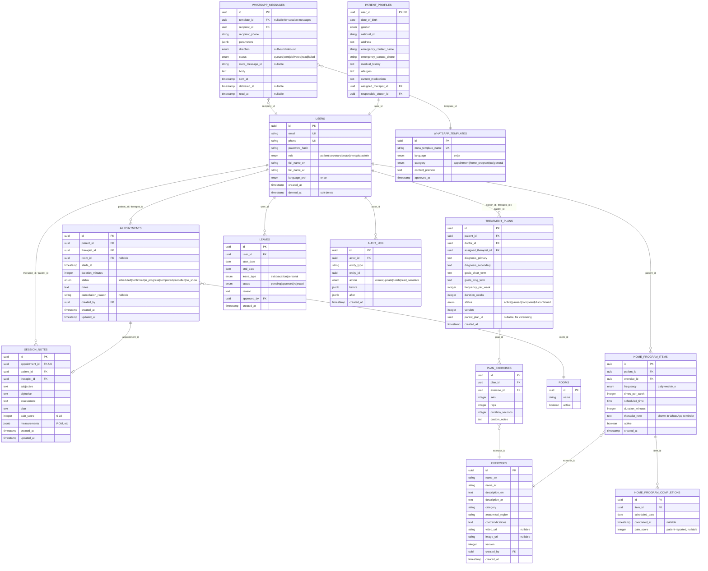
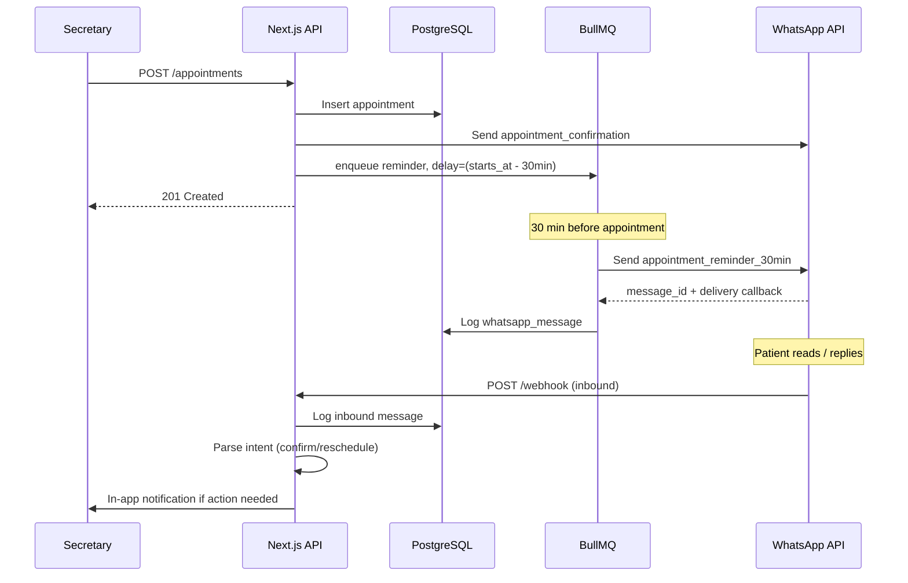

# Theone.pt — Technical Specification Document

| Field | Value |
|---|---|
| **Project** | Theone.pt — Physical Therapy Clinic Management System |
| **Version** | 1.0 (Draft) |
| **Date** | May 2026 |
| **Status** | Draft for review |
| **Audience** | Engineering team, product owner, clinic stakeholders |
| **Languages supported** | English + Arabic (RTL) |

---

## 1. Document purpose

This document defines the scope, behavior, architecture, data model, and delivery plan for **Theone.pt**, a multi-role web application that manages the day-to-day operations of a physical therapy center. It is the source of truth for the engineering team during build, and the reference point for clarifying scope, behavior, and acceptance criteria.

If a requirement is not in this document, it is not in the scope of the first release.

---

## 2. Project overview

Theone.pt is a responsive, mobile-friendly web application that supports five distinct user roles working together inside one physical therapy clinic:

- **Patient (المراجع)** — books and views appointments, performs home exercises, receives WhatsApp reminders.
- **Secretary (السكرتيرة)** — the operational core of the system: books appointments, drag-and-drops to reschedule, assigns or changes the responsible therapist, monitors conflicts.
- **Doctor (الدكتورة)** — creates the patient's treatment plan, assigns it to a therapist, reviews end-of-day/end-of-week reports, adds clinical notes.
- **Therapist / Physiotherapist (المعالج الطبيعي)** — executes the doctor's plan, updates the shared patient timeline, writes session reports, uploads home-program videos and images.
- **Admin (المسؤول)** — manages users, roles, leave, business settings, and has read access to all clinical data.

The system integrates with **WhatsApp Cloud API (Meta Business Platform)** to send appointment confirmations, automatic 30-minute reminders, and home-exercise prompts.

The product is bilingual from day one. All UI strings exist in English and Arabic, with full RTL mirroring when Arabic is active.

---

## 3. Glossary

| Term (EN) | Term (AR) | Meaning |
|---|---|---|
| Appointment | موعد | A scheduled visit between a patient and a therapist |
| Treatment plan | الخطة العلاجية | The doctor's prescription for a patient: goals, exercises, sessions |
| Session note | تقرير الجلسة | The therapist's note after each session |
| Patient timeline / history | ملف المريض / التاريخ | The full chronological record of every clinical event for one patient |
| Home program | برنامج بيتي | Exercises the patient performs at home, with optional video/image |
| Template (WhatsApp) | قالب وتساب | A pre-approved Meta template message used for proactive sends |
| RBAC | صلاحيات | Role-based access control |
| RTL | من اليمين لليسار | Right-to-left UI mirroring for Arabic |

---

## 4. User roles & permissions (RBAC)

### 4.1 Permission matrix

`C` = Create, `R` = Read, `U` = Update, `D` = Delete, `—` = No access, `R*` = Read own/assigned only

| Resource | Patient | Secretary | Doctor | Therapist | Admin |
|---|---|---|---|---|---|
| Own profile | R, U | R, U | R, U | R, U | R, U |
| Other users | — | R (patients/therapists) | R (assigned patients) | R (assigned patients) | C, R, U, D |
| Appointments | R* | C, R, U, D | R* | R* | C, R, U, D |
| Treatment plans | R* | R | C, R, U (own) | R, U (assigned) | R |
| Session notes | — | R | R (assigned patients) | C, R, U (own); R (others) | R |
| Patient timeline | R* (limited) | R | R (assigned) | R (assigned) | R |
| Home program | R* | R | R | C, R, U (assigned) | R |
| Exercise media (video/image) | R* | — | — | C, R, U, D (own uploads) | C, R, U, D |
| Leaves (own) | — | C, R | C, R | C, R | C, R |
| Leaves (others) | — | R | — | — | C, R, U, D |
| Reports | — | R | R | R (own) | R |
| WhatsApp templates | — | — | — | — | C, R, U, D |
| System settings | — | — | — | — | C, R, U, D |

### 4.2 Notes on role rules

- A **Therapist** can update a treatment plan **assigned to them** (e.g., adjust exercise volume), but the **Doctor** must be notified of changes. An audit trail records every edit.
- A **Patient** can view session notes only if the clinic enables a setting `patient_can_view_clinical_notes` (default: **off**, for clinical privacy).
- An **Admin** never edits clinical content (notes, plans) directly — they can only read, manage users, and reassign work. This protects clinical integrity.
- **Doctor** sees only patients they are clinically responsible for, plus any patient whose case they have been consulted on (set by Admin or Secretary).

---

## 5. Functional requirements

This section describes **what** the system does, module by module. Each requirement is identified `FR-{module}-{n}` for traceability.

### 5.1 Authentication & onboarding (FR-AUTH)

- **FR-AUTH-1** — All users authenticate with email + password. Patients may alternatively authenticate with mobile number + OTP sent over WhatsApp.
- **FR-AUTH-2** — On first login, all users must accept the Privacy Policy and Terms of Service (versioned, stored).
- **FR-AUTH-3** — Patients may self-register via the patient portal. Staff users (Secretary, Doctor, Therapist, Admin) are created **only** by Admin.
- **FR-AUTH-4** — Password reset: email link for staff; OTP over WhatsApp for patients.
- **FR-AUTH-5** — Session: JWT in HTTP-only cookie, 7-day rolling expiry, refresh-on-activity. Sliding window, not absolute.
- **FR-AUTH-6** — RBAC enforced at both API and UI layer. Direct API calls that bypass UI must be rejected by middleware.

### 5.2 Patient management (FR-PAT)

- **FR-PAT-1** — Each patient has a profile with: full name (AR + EN), national ID / passport (optional), DOB, gender, phone (WhatsApp), email (optional), address, emergency contact, medical history summary, allergies, current medications.
- **FR-PAT-2** — Profile data is editable by Secretary and Admin only. Patients may edit non-clinical fields (phone, address, emergency contact) but request approval for clinical-sensitive fields.
- **FR-PAT-3** — Each patient has a primary **assigned therapist** (set by Secretary) and a **responsible doctor** (set when a treatment plan is created).
- **FR-PAT-4** — Soft-delete only. Patient records are never hard-deleted; they are archived. Restoration is possible by Admin.

### 5.3 Appointment scheduling (FR-APP) — *Secretary's core workflow*

- **FR-APP-1** — Secretary can create an appointment by selecting: patient, therapist, date, start time, duration (defaults to 30 min, configurable), service type, room (optional), and notes.
- **FR-APP-2** — On creation, the system validates:
  1. The selected therapist has no overlapping appointment in the same time window.
  2. The selected therapist is not on approved leave in that time window.
  3. The patient has no overlapping appointment.
  4. The clinic is open at that time (business hours setting).
- **FR-APP-3** — If a conflict exists, the booking is **rejected** with a clear message identifying the conflict (e.g., *"Therapist Ahmad has an appointment with Patient Sara at 10:00–10:30"*). The Secretary then either picks a different time, picks a different therapist, or overrides only after explicit confirmation (override is logged).
- **FR-APP-4** — Secretary may **change the assigned therapist** for an existing appointment via a "Change therapist" action. The system performs the same conflict checks for the new therapist; on success, both therapists are notified (in-app + optional WhatsApp).
- **FR-APP-5** — Secretary may **reschedule** an existing appointment by dragging it to a new time slot or a new day/week on the calendar view. The system re-runs all conflict checks.
- **FR-APP-6** — Appointment statuses: `scheduled` → `confirmed` → `in_progress` → `completed` | `cancelled` | `no_show`. Status transitions are restricted (e.g., a completed appointment cannot return to scheduled).
- **FR-APP-7** — Cancellations capture a reason (free text + optional category: patient request, therapist unavailable, clinic closure, other). Cancellations within < 2 hours of the slot are flagged.
- **FR-APP-8** — Recurring appointments: Secretary can schedule a series (e.g., 3× weekly for 4 weeks). Conflicts are reported per occurrence; the Secretary can choose to skip conflicting occurrences or shift them.

### 5.4 Calendar view (FR-CAL)

- **FR-CAL-1** — Day, Week, and Month views.
- **FR-CAL-2** — Resource view: columns per therapist (Week and Day views), showing each therapist's schedule side-by-side. This is the primary working view for Secretary.
- **FR-CAL-3** — Drag-and-drop to move an appointment to a new time slot (Day/Week view) or a new day (Month view).
- **FR-CAL-4** — Color coding: appointments by status (scheduled = blue, completed = gray, cancelled = red, no-show = amber), or by therapist (toggle).
- **FR-CAL-5** — Clicking an appointment opens a side-panel with: patient summary, last visit, treatment plan link, full edit form, "Change therapist", "Reschedule", "Cancel", "Mark as completed".
- **FR-CAL-6** — Clicking on a patient name within the panel deep-links to the full **Patient file** (see 5.6).
- **FR-CAL-7** — Visual indicator on therapist columns when the therapist is on leave (greyed-out background with a "Leave" label).

### 5.5 Treatment plans (FR-PLAN) — *Doctor's core workflow*

- **FR-PLAN-1** — Doctor creates a treatment plan attached to a patient. Plan contains: clinical assessment, primary diagnosis, secondary diagnoses, goals (short-term, long-term), prescribed exercises (selected from the Exercise Library or custom), session frequency, plan duration (weeks), and notes for the therapist.
- **FR-PLAN-2** — A plan is assigned to a primary Therapist. The Therapist receives an in-app notification.
- **FR-PLAN-3** — The Therapist may **propose changes** to the plan (adjust exercise volume, swap an exercise, extend duration). Changes are saved as a "proposed revision"; the Doctor approves or rejects.
- **FR-PLAN-4** — Quick path: for low-stakes adjustments (within ±20% volume), the Therapist may apply directly; the change is logged and surfaced to the Doctor in their daily review without blocking work.
- **FR-PLAN-5** — Plans can be `active`, `completed`, `paused`, or `discontinued`. Only one active plan per patient at a time.
- **FR-PLAN-6** — Each plan has a versioned history. Every edit creates a new version; previous versions are retrievable.

### 5.6 Patient file & shared timeline (FR-FILE)

- **FR-FILE-1** — Every patient has a single **patient file** page that aggregates:
  - Profile and medical history
  - All appointments (past, upcoming) with status
  - Treatment plans (active + archived)
  - Session notes from every therapist who has seen the patient
  - Home program with completion status
  - Doctor's notes and weekly reviews
  - Uploaded files (imaging, referrals)
- **FR-FILE-2** — The session-note timeline is **shared across the clinical team** (all Therapists, the Doctor, Admin). This ensures that if a Therapist is absent, any colleague can pick up the case.
- **FR-FILE-3** — Each timeline entry shows: timestamp, author (with role), entry type (note / plan update / appointment / report), and content. Entries are immutable once committed; edits create a new entry referencing the old one.
- **FR-FILE-4** — Filters and search: filter by date range, author, entry type. Full-text search on note content.

### 5.7 Session notes & reports (FR-NOTE) — *Therapist's core workflow*

- **FR-NOTE-1** — At the end of every session, the assigned Therapist writes a **session note** containing: subjective (patient's reported state), objective (measured findings: ROM, pain score, etc.), assessment (interpretation), plan (what to do next session) — the **SOAP** format.
- **FR-NOTE-2** — The Therapist can use a structured form (recommended) or free-text. Structured fields support quick analytics later.
- **FR-NOTE-3** — Session notes are linked to the appointment record. Marking an appointment as `completed` opens the note form.
- **FR-NOTE-4** — End-of-day report: the Therapist may submit a daily summary listing all patients seen, key observations, and any concerns. Auto-generated draft, editable.
- **FR-NOTE-5** — End-of-week report: aggregated view for the Doctor. The Doctor reviews and adds clinical comments per patient.
- **FR-NOTE-6** — Notifications: when a Therapist submits an end-of-day report, the responsible Doctor is notified.

### 5.8 Home program (FR-HOME)

- **FR-HOME-1** — The Therapist (or Doctor) creates a home program for a patient by selecting exercises from the Exercise Library or creating new ones inline.
- **FR-HOME-2** — Each exercise in a home program has: name, description (EN + AR), instruction text, optional video (MP4, ≤ 50 MB), optional image, frequency (daily, weekly N times), recommended time-of-day, duration in minutes, and free-text notes (e.g., "stop if pain > 4/10").
- **FR-HOME-3** — The patient sees their home program in their portal, with the video/image, instructions, and a **"Mark as done"** button per scheduled occurrence. Completion is logged.
- **FR-HOME-4** — Scheduled time-of-day for an exercise triggers a WhatsApp reminder 30 minutes before the scheduled time (see 5.10).
- **FR-HOME-5** — The Therapist sees patient compliance (how often they marked exercises done) on the patient file. Non-compliance flags an action item.

### 5.9 Exercise library (FR-EX)

- **FR-EX-1** — A shared, clinic-wide library of exercises. Therapists and Doctors can contribute.
- **FR-EX-2** — Each exercise: name (EN + AR), category (e.g., shoulder, knee, gait), default duration, default instruction template, optional video, optional image, contraindications.
- **FR-EX-3** — Search by name, category, or anatomical region.
- **FR-EX-4** — Versioning: edits create a new version; older home programs that reference an old version continue to use that version.

### 5.10 WhatsApp notifications (FR-WA)

This is integration-heavy; see Section 10 for the full integration spec. Summary of behavior:

- **FR-WA-1** — On appointment creation: send a confirmation message to the patient with date, time, therapist name, clinic address.
- **FR-WA-2** — Automatic reminder: 30 minutes before each appointment, send the patient a reminder ("Reminder: your appointment with [therapist] is in 30 minutes…"). Configurable per-clinic (15, 30, 60, 120 minutes).
- **FR-WA-3** — On reschedule: send the patient an updated message with the new time.
- **FR-WA-4** — On cancellation: send the patient a cancellation notice.
- **FR-WA-5** — Home program reminders: 30 minutes before each scheduled exercise time, send the patient a message with the exercise name, the Therapist's custom note for that exercise, and a link to the patient portal for the video.
- **FR-WA-6** — Two-way: a patient may reply `1` to confirm, `2` to request reschedule. The system parses inbound replies and surfaces them to the Secretary as actionable items.
- **FR-WA-7** — Delivery, read, and reply status is logged. Failures (no WhatsApp, wrong number) are surfaced to Secretary.
- **FR-WA-8** — All messages use **pre-approved Meta templates** (English and Arabic versions). Patient language preference (from profile) determines which template is sent.

### 5.11 Leave management (FR-LEAVE)

- **FR-LEAVE-1** — Any staff user may submit a leave request (date range, reason, leave type: sick, vacation, personal). Admin approves or rejects.
- **FR-LEAVE-2** — Admin can also create leave on behalf of any staff member.
- **FR-LEAVE-3** — On leave approval, the system **scans existing appointments** within the leave window assigned to that user. For each conflict, an alert is raised on the Secretary's dashboard.
- **FR-LEAVE-4** — The Secretary resolves each conflict by either reassigning the appointment to another therapist (with conflict re-check) or rescheduling it.
- **FR-LEAVE-5** — Once approved, the user's calendar column shows the leave block; new appointments cannot be created in that block.

### 5.12 Reporting & analytics (FR-REP)

- **FR-REP-1** — Dashboard for Admin: today's appointments, no-show rate (7d / 30d), revenue (if billing enabled — out of scope v1), utilization per therapist, top diagnoses.
- **FR-REP-2** — Doctor dashboard: active patients, plans due for review, week's session notes, weekly summary per patient.
- **FR-REP-3** — Therapist dashboard: today's schedule, pending session notes, assigned patients, home-program compliance flags.
- **FR-REP-4** — Patient dashboard: next appointment, today's home program, completion streak.

### 5.13 Admin panel (FR-ADM)

- **FR-ADM-1** — User CRUD across all roles.
- **FR-ADM-2** — Role and permission management (preset roles; no custom roles in v1).
- **FR-ADM-3** — Clinic settings: business hours, default appointment duration, reminder offset, time zone, languages, default service types.
- **FR-ADM-4** — WhatsApp settings: business phone number, approved templates, message logs.
- **FR-ADM-5** — Audit log viewer (FR-AUDIT-1): every state-changing action (appointment edit, plan change, user edit) is recorded with actor, timestamp, before/after values.
- **FR-ADM-6** — Data export: patient data (own patient) export as PDF; clinic-wide CSV exports for appointments and revenue.

---

## 6. Non-functional requirements

| Category | Requirement |
|---|---|
| **Performance** | P95 page load < 2.5s on 3G. Calendar view renders 500 appointments in < 500ms. |
| **Availability** | Target 99.5% monthly uptime. Acceptable outage window: 1 hour/week for maintenance, off-hours. |
| **Mobile** | Responsive from 320px (iPhone SE) and up. Calendar view on mobile collapses to single-therapist day view by default. |
| **Internationalization** | Full EN/AR support. RTL mirroring in Arabic mode. Hijri / Gregorian calendar toggle in date displays. Arabic numerals (Eastern or Arabic-Indic, user preference). |
| **Accessibility** | WCAG 2.1 AA target. Keyboard navigation on calendar. Color is never the only signal. |
| **Security** | All traffic over HTTPS. Passwords hashed with bcrypt (cost 12+). Patient data encrypted at rest. PII never logged. Session cookies HTTP-only, Secure, SameSite=Lax. |
| **Privacy** | Clinical data accessible only to assigned clinicians + Admin. Audit trail for every read of sensitive fields (configurable). Patient may request data export and account deletion (right to erasure). |
| **Compliance** | Designed to align with Jordan's PDPL principles; not certified for healthcare-specific regimes (HIPAA, GDPR Article 9). Clinic should consult legal counsel before storing certain data classes. |
| **Backups** | Daily encrypted DB backups, retained 30 days. Weekly full backup retained 90 days. Tested restore quarterly. |
| **Audit** | All state changes recorded for 1 year minimum. Read-only after 30 days (no edits to historical audit entries). |
| **Browser support** | Latest 2 versions of Chrome, Safari, Firefox, Edge. Safari iOS 15+, Chrome Android 100+. |

---

## 7. System architecture

### 7.1 Tech stack

| Layer | Choice | Why |
|---|---|---|
| **Frontend framework** | Next.js 15 (App Router) | SSR for performance, file-based routing, server actions reduce API surface, mature i18n. |
| **UI library** | Tailwind CSS + shadcn/ui | Customizable, accessible, RTL-friendly, no heavy runtime. |
| **Calendar component** | FullCalendar.io (premium resource view) or react-big-calendar (free) | Mature drag-and-drop, resource columns, RTL support. |
| **State management** | TanStack Query (server state) + Zustand (UI state) | Server state separated from UI state; avoids over-engineering. |
| **Backend runtime** | Node.js 20+ inside Next.js API Routes / Server Actions | One codebase, type-shared between front and back. |
| **ORM** | Prisma | Type-safe, migrations, great DX, well-known. |
| **Database** | PostgreSQL 16 | Relational integrity for clinical data, JSONB for flexible fields, mature tooling. |
| **Auth** | Auth.js (NextAuth) v5 + custom providers (email/password, WhatsApp OTP) | Standard, secure, extensible. |
| **Job queue** | BullMQ + Redis | For scheduled WhatsApp reminders, background reports. |
| **File storage** | S3-compatible (AWS S3 or DigitalOcean Spaces) | Industry standard, CDN-friendly, presigned uploads for direct browser → S3. |
| **WhatsApp** | Meta Cloud API (Business Platform) | Free 1,000 conversations/month, direct, scalable. |
| **Hosting** | Vercel (app) + Neon / Supabase (DB) + Upstash (Redis) — *or* a single VPS with Docker Compose for cost simplicity | Two tiers proposed; pick based on traffic and budget. |
| **Monitoring** | Sentry (errors) + Axiom or BetterStack (logs) + Uptime Robot | Minimal, sufficient for v1. |
| **CI/CD** | GitHub Actions | Build, test, lint, deploy on push to `main`. |

### 7.2 High-level component view

```
┌─────────────────────────────────────────────────────────┐
│  Next.js application (single deployment)                │
│                                                          │
│  ┌──────────────┐  ┌──────────────┐  ┌──────────────┐  │
│  │ Patient UI   │  │ Staff UI     │  │ Admin UI     │  │
│  │ (portal)     │  │ (dashboards) │  │ (panel)      │  │
│  └──────┬───────┘  └──────┬───────┘  └──────┬───────┘  │
│         └────────────┬────┴─────────────────┘          │
│                      ▼                                  │
│         ┌────────────────────────┐                     │
│         │ Server Actions + APIs  │  (RBAC middleware)  │
│         └────────────┬───────────┘                     │
└──────────────────────┼──────────────────────────────────┘
                       ▼
        ┌──────────────────────────────────┐
        │ Prisma → PostgreSQL              │
        └──────────────────────────────────┘
                       │
   ┌───────────────────┼───────────────────┐
   ▼                   ▼                   ▼
┌──────────┐   ┌──────────────┐   ┌────────────────┐
│ Redis +  │   │ S3 storage   │   │ WhatsApp Cloud │
│ BullMQ   │   │ (videos)     │   │ API (Meta)     │
└──────────┘   └──────────────┘   └────────────────┘
```

---

## 8. Database schema

### 8.1 Entity-relationship diagram (Mermaid)



### 8.2 Key constraints and indexes

- `appointments`: composite index on `(therapist_id, starts_at, duration_minutes)` for fast conflict detection.
- `appointments`: index on `(patient_id, starts_at desc)` for patient timeline.
- `session_notes`: unique constraint on `appointment_id` (one note per appointment).
- `treatment_plans`: partial unique index on `(patient_id) WHERE status = 'active'` (only one active plan).
- `home_program_completions`: composite index on `(item_id, scheduled_date)`.
- `whatsapp_messages`: index on `recipient_phone, sent_at desc` for inbound matching.
- `audit_log`: index on `entity_type, entity_id, created_at desc`.

### 8.3 Sensitive data handling

- Patient phone, national ID, medical history are encrypted at rest using `pgcrypto` symmetric encryption, key in environment variable.
- Audit log captures **diff** of changes, not full PII snapshots, unless required (e.g., legal hold).

---

## 9. API design

REST conventions, JSON payloads, JWT auth via HTTP-only cookie. All routes prefixed `/api/v1`. Server actions used internally for form mutations; below are the public-facing API endpoints (mobile compatibility + future Salma AI integrations).

### 9.1 Auth

| Method | Path | Body | Notes |
|---|---|---|---|
| POST | `/api/v1/auth/login` | `{email, password}` | Returns session cookie |
| POST | `/api/v1/auth/otp/request` | `{phone}` | Sends OTP via WhatsApp |
| POST | `/api/v1/auth/otp/verify` | `{phone, otp}` | Returns session cookie |
| POST | `/api/v1/auth/logout` | — | Clears cookie |
| POST | `/api/v1/auth/password/reset` | `{email}` | Email link |
| GET | `/api/v1/auth/me` | — | Current user + role |

### 9.2 Users

| Method | Path | Notes |
|---|---|---|
| GET | `/api/v1/users` | Admin only; filter by role |
| POST | `/api/v1/users` | Admin only |
| GET | `/api/v1/users/{id}` | RBAC checked |
| PATCH | `/api/v1/users/{id}` | RBAC checked |
| DELETE | `/api/v1/users/{id}` | Soft delete; Admin only |

### 9.3 Appointments

| Method | Path | Notes |
|---|---|---|
| GET | `/api/v1/appointments?from=…&to=…&therapist_id=…` | Calendar feed |
| POST | `/api/v1/appointments` | Creates with conflict check |
| PATCH | `/api/v1/appointments/{id}` | Reschedule / change therapist / status |
| DELETE | `/api/v1/appointments/{id}` | Cancellation (sets status) |
| POST | `/api/v1/appointments/recurring` | Bulk-create a series |
| GET | `/api/v1/appointments/conflicts?therapist_id=…&starts_at=…&duration=…` | Pre-check before commit |

### 9.4 Patients

| Method | Path | Notes |
|---|---|---|
| GET | `/api/v1/patients` | Secretary/Admin |
| GET | `/api/v1/patients/{id}` | Full patient file |
| GET | `/api/v1/patients/{id}/timeline` | Aggregated history |
| GET | `/api/v1/patients/{id}/appointments` | |
| GET | `/api/v1/patients/{id}/notes` | |
| GET | `/api/v1/patients/{id}/plans` | |

### 9.5 Treatment plans

| Method | Path | Notes |
|---|---|---|
| POST | `/api/v1/plans` | Doctor only |
| GET | `/api/v1/plans/{id}` | Versioned response includes version chain |
| PATCH | `/api/v1/plans/{id}` | Creates new version |
| POST | `/api/v1/plans/{id}/propose` | Therapist proposes change |
| POST | `/api/v1/plans/{id}/approve` | Doctor approves proposal |

### 9.6 Session notes

| Method | Path | Notes |
|---|---|---|
| POST | `/api/v1/session-notes` | Therapist; one per appointment |
| GET | `/api/v1/session-notes/{id}` | |
| PATCH | `/api/v1/session-notes/{id}` | Within 24h window; afterward immutable |

### 9.7 Home program

| Method | Path | Notes |
|---|---|---|
| POST | `/api/v1/home-program/items` | Add exercise to patient program |
| GET | `/api/v1/home-program?patient_id=…` | |
| PATCH | `/api/v1/home-program/items/{id}` | |
| POST | `/api/v1/home-program/completions` | Patient marks done |

### 9.8 Exercises

| Method | Path | Notes |
|---|---|---|
| GET | `/api/v1/exercises?q=…&category=…` | Search |
| POST | `/api/v1/exercises` | Therapist/Doctor |
| POST | `/api/v1/exercises/{id}/media` | Returns S3 presigned URL for direct upload |

### 9.9 Leaves

| Method | Path | Notes |
|---|---|---|
| POST | `/api/v1/leaves` | Request |
| GET | `/api/v1/leaves?status=pending` | Admin |
| POST | `/api/v1/leaves/{id}/approve` | Admin; triggers conflict scan |
| POST | `/api/v1/leaves/{id}/reject` | Admin |

### 9.10 WhatsApp webhook

| Method | Path | Notes |
|---|---|---|
| GET | `/api/v1/whatsapp/webhook` | Meta verification challenge |
| POST | `/api/v1/whatsapp/webhook` | Inbound messages and delivery status |

### 9.11 Error format

```json
{
  "error": {
    "code": "APPOINTMENT_CONFLICT",
    "message": "Therapist has an overlapping appointment.",
    "message_ar": "المعالج لديه موعد متعارض.",
    "details": {
      "conflicting_appointment_id": "uuid",
      "starts_at": "2026-06-01T10:00:00+03:00"
    }
  }
}
```

---

## 10. WhatsApp integration (Meta Cloud API)

### 10.1 Setup checklist

1. **Meta Business Account** + **WhatsApp Business Account (WABA)** created.
2. **Business verified** with Meta (clinic commercial registration). *Allow 1–2 weeks.*
3. **Phone number** registered with WABA. Cannot be in personal WhatsApp use.
4. **System User token** generated with permissions: `whatsapp_business_messaging`, `whatsapp_business_management`.
5. **Webhook** endpoint configured (`/api/v1/whatsapp/webhook`) + verification token.
6. **Templates** drafted and submitted to Meta for approval (24–48 hours each).

### 10.2 Required templates (initial set)

| Name | Language | Category | Variables |
|---|---|---|---|
| `appointment_confirmation` | en, ar | UTILITY | `{patient_name}`, `{therapist_name}`, `{date}`, `{time}`, `{clinic_address}` |
| `appointment_reminder_30min` | en, ar | UTILITY | `{patient_name}`, `{therapist_name}`, `{time}` |
| `appointment_rescheduled` | en, ar | UTILITY | `{patient_name}`, `{new_date}`, `{new_time}`, `{therapist_name}` |
| `appointment_cancelled` | en, ar | UTILITY | `{patient_name}`, `{date}`, `{time}`, `{reason}` |
| `home_exercise_reminder` | en, ar | UTILITY | `{patient_name}`, `{exercise_name}`, `{therapist_note}`, `{portal_link}` |
| `otp_login` | en, ar | AUTHENTICATION | `{otp}` |

Sample (`appointment_reminder_30min`, Arabic):

> مرحبا {{1}}، تذكير بموعدك مع المعالج {{2}} الساعة {{3}}. شكراً لاختياركم Theone.pt.

### 10.3 Reminder scheduling flow



### 10.4 Webhook handler responsibilities

1. **Verify signature** using app secret (HMAC SHA-256 of payload).
2. **Idempotency**: keyed by `meta_message_id` — duplicate webhooks are ignored.
3. **Update message status** (`sent` → `delivered` → `read`).
4. **Parse inbound** messages; map to recipient by phone.
5. **Auto-reply** logic for known intents (e.g., `1` = confirm) is handled server-side; unknown messages are surfaced to the Secretary.

### 10.5 Failure handling

- **Template not approved** → fall back to free-form text (only valid in 24h conversation window) or skip with admin alert.
- **Number not on WhatsApp** → flag patient profile; Secretary contacts via phone.
- **Rate limit hit** (1000 conversations/month free tier) → switch to paid tier automatically; alert Admin.
- **Webhook outage** → Meta retries for 7 days; queue catches up.

---

## 11. Frontend architecture

### 11.1 Next.js App Router structure

```
/app
  /[locale]               # 'en' | 'ar' segment for i18n
    /(auth)               # Auth route group
      /login
      /forgot-password
    /(patient)            # Patient portal
      /dashboard
      /appointments
      /home-program
      /profile
    /(staff)              # Staff dashboards
      /(secretary)
        /calendar         # Main view
        /patients
        /patients/[id]
      /(therapist)
        /schedule
        /patients/[id]
        /notes/[appointmentId]
      /(doctor)
        /dashboard
        /patients/[id]
        /plans/[id]
    /(admin)
      /users
      /settings
      /audit
  /api
    /v1
      /...                # API routes per Section 9
/components
  /ui                     # shadcn primitives
  /calendar
  /patient-file
  /whatsapp
/lib
  /db                     # Prisma client
  /auth                   # Auth.js config
  /rbac                   # Permission helpers
  /whatsapp               # Meta API client
  /queue                  # BullMQ queues
/messages                 # i18n catalogs
  en.json
  ar.json
```

### 11.2 Internationalization & RTL

- Library: `next-intl` (good Next 15 App Router support).
- All UI strings in `/messages/en.json` and `/messages/ar.json`. No hardcoded user-facing strings.
- The `[locale]` segment drives both translation and `dir` attribute: `<html lang={locale} dir={locale === 'ar' ? 'rtl' : 'ltr'}>`.
- Tailwind's logical properties (`ms-4` / `me-4`, `start-0` / `end-0`) used everywhere; no `ml-`/`mr-` for layout.
- Icons that imply direction (← chevrons, arrows) flip automatically with `rtl:rotate-180` utility.
- Numbers: locale-aware formatting via `Intl.NumberFormat`. Phone numbers always LTR even in Arabic context (using Unicode LRM markers).
- Dates: Gregorian by default; toggle Hijri display in user preferences.
- Fonts: `Inter` for Latin, `IBM Plex Sans Arabic` (or `Cairo`) for Arabic. CSS `unicode-range` to load on demand.

### 11.3 Calendar implementation notes

- Use **FullCalendar** with the `resourceTimeGridDay` and `resourceTimeGridWeek` views. Therapists are resources.
- Drag-and-drop fires an optimistic UI update + a `PATCH /appointments/{id}` with `starts_at`. On conflict, the API returns `409` and the UI reverts with a toast.
- The calendar should virtualize rendering for clinics with many therapists (5+) to keep frame rate smooth.
- RTL: FullCalendar supports `direction: 'rtl'`. Some custom CSS overrides are needed for the resource column header alignment.

---

## 12. Authentication & authorization

- **Auth.js v5** with two providers: Credentials (staff: email + password) and a custom Phone-OTP provider (patients: phone + WhatsApp OTP).
- Session strategy: **JWT in HTTP-only cookie**. Database sessions optional; JWT is sufficient given user count.
- **RBAC middleware**: `lib/rbac/check.ts` exports `can(user, action, resource)` returning boolean. Used in:
  - Server actions (throw `ForbiddenError` if disallowed)
  - API routes (return 403)
  - UI components (`<Can action="appointments.create"><CreateBtn/></Can>`)
- Permissions live in a static map. No dynamic permissions in v1.
- **Audit decorator** wraps every state-changing service function and writes to `audit_log`.

---

## 13. Security & compliance

### 13.1 Threat model summary

| Threat | Mitigation |
|---|---|
| Stolen session cookie | HTTP-only, Secure, SameSite=Lax; 7-day expiry with idle rotation |
| Credential stuffing | Rate limit `/auth/login` (5/min/IP); account lockout after 10 failures (15 min); password complexity policy |
| Privilege escalation | RBAC at API + UI; permission checks centralized; tests for every role × endpoint |
| PII leak via logs | Custom logger redacts `phone`, `national_id`, `medical_history` |
| SQL injection | Prisma parameterized queries; no raw SQL except in vetted migrations |
| XSS | React escapes by default; rich-text fields sanitized server-side via DOMPurify |
| CSRF | SameSite cookies; double-submit token for state-changing API calls from external origins |
| File upload abuse | S3 presigned URLs with content-type + size restrictions; antivirus scan post-upload (ClamAV) |
| Direct object reference | All resource lookups scope by user context (e.g., `WHERE patient_id IN (assigned_patients)`) |

### 13.2 Patient data rights

- **Right to access**: Patient can export their full record as PDF from their profile.
- **Right to erasure**: Patient may request account deletion. Clinical data is retained as required by local medical record law (typically 7–10 years), but PII is pseudonymized.
- **Right to rectification**: Patient may edit non-clinical profile fields; clinical-sensitive edits go through Secretary.

---

## 14. Deployment architecture

### 14.1 Recommended deployment (Option A — managed services)

| Component | Service | Notes |
|---|---|---|
| App hosting | Vercel | Auto deploys from `main`; preview deploys per PR |
| Database | Neon or Supabase Postgres | Branching support for staging |
| Redis | Upstash | Serverless-friendly |
| File storage | AWS S3 (eu-central-1 or me-south-1 for low latency to Amman) | |
| WhatsApp | Meta Cloud API | Direct |
| Monitoring | Sentry + Axiom | |
| Secrets | Vercel env vars | Per-environment |

Approximate monthly cost at low traffic (single clinic, 20 staff, 500 patients): **~$80–$150 USD**.

### 14.2 Alternative (Option B — single VPS)

A single 4 GB DigitalOcean / Hetzner VPS running Docker Compose with: Next.js app, PostgreSQL, Redis, MinIO (S3-compatible), Caddy reverse proxy, Sentry self-hosted (optional).

Cost: **~$25–$40 USD/month**. Pros: lower cost. Cons: you operate it (backups, OS updates, scaling).

### 14.3 Environments

- **Production** — `theone.pt`
- **Staging** — `staging.theone.pt`, mirrors production schema, sample data only
- **Local dev** — Docker Compose; seeded with realistic test data

### 14.4 CI/CD

- GitHub Actions: lint → typecheck → test → build → deploy
- DB migrations via Prisma Migrate; reviewed in PRs; auto-applied on staging, manually approved on production
- Feature flags via env vars (or Unleash/PostHog) for risky rollouts

---

## 15. Phased roadmap

Estimates assume **1 senior full-stack engineer** working full-time, with input from the clinic on requirements. A second engineer roughly halves duration with some coordination overhead.

| Phase | Scope | Deliverable | Estimate |
|---|---|---|---|
| **0. Foundation** | Repo, CI, environments, Auth, RBAC scaffolding, DB schema, base UI shell, i18n setup | Empty but secure app with login, role switching, AR/EN toggle | **2 weeks** |
| **1. Patient & user management** | CRUD for all user types, Admin panel for staff users, patient profile pages | Admin can manage users; secretary can manage patients | **1.5 weeks** |
| **2. Appointments (core)** | Calendar (day/week/resource view), create/edit/cancel, conflict detection, drag-and-drop reschedule, change therapist | Secretary's full workflow functional, no WhatsApp yet | **3 weeks** |
| **3. WhatsApp integration** | Meta setup, template approvals, confirmation + 30min reminder, reschedule/cancel notifications, webhook + inbound parsing, OTP login | Live WhatsApp flows; patient OTP login working | **2.5 weeks** |
| **4. Clinical workflows** | Treatment plans (doctor), session notes (therapist), shared patient timeline, end-of-day/week reports | Doctor and Therapist roles fully operational | **3 weeks** |
| **5. Home program** | Exercise library, home program builder, video/image upload, patient portal home-program view, scheduled WhatsApp reminders, completion tracking | Patients receive home programs and reminders | **2.5 weeks** |
| **6. Leave & polish** | Leave management with conflict scan, dashboards/reports for all roles, audit log viewer, accessibility pass, mobile polish | Production-ready v1 | **2 weeks** |
| **Total** | | | **~16.5 weeks (≈ 4 months)** |

### 15.1 Milestone gates

- After Phase 2 → run a **pilot with Secretary only**, schedule real (test) appointments without WhatsApp. Validate calendar UX before continuing.
- After Phase 3 → run a **closed beta** with 5–10 real patients on WhatsApp reminders. Validate template wording with native Arabic speakers.
- After Phase 5 → run a **wider beta** with the full clinical team.
- After Phase 6 → **soft launch** with one clinic; monitor for 2 weeks before opening to more clinics (if multi-tenant becomes a goal).

---

## 16. Risks & mitigations

| # | Risk | Likelihood | Impact | Mitigation |
|---|---|---|---|---|
| R1 | Meta template approval rejected or delayed | Medium | High (delays WhatsApp launch) | Submit templates in Phase 2 (parallel with calendar build); have fallback wording; engage a Meta-experienced partner if rejections stack |
| R2 | Business verification with Meta takes longer than expected | Medium | High | Start verification on Day 1 of project; ensure clinic has commercial registration + utility bill ready |
| R3 | Calendar UX falls short for power users | Medium | Medium | Pilot with Secretary in Phase 2; budget 1 week of iteration before Phase 3 |
| R4 | Bilingual content drift (EN strings updated, AR forgotten) | High | Low | CI check fails build if a key exists in `en.json` but not `ar.json` |
| R5 | Patient privacy incident | Low | Very high | Pre-launch security review; encrypted PII at rest; audit logs; pen-test before public launch |
| R6 | WhatsApp cost overrun if patient base grows fast | Low | Medium | Monitor monthly conversation count; alerting at 80% of free tier; budget moves to paid tier at ~1500 patients |
| R7 | Therapist resistance to structured notes (vs free text) | Medium | Medium | Phase 4 ships with free-text option; structured fields added progressively |
| R8 | Mobile drag-and-drop UX is awkward | Medium | Medium | On mobile, default to "tap to reschedule" modal; drag-and-drop stays for desktop |
| R9 | Data migration if clinic has existing records | Medium | Medium | Provide CSV import for patients and historical appointments; one-time job in Phase 1 |

---

## 17. Open questions

These need answers before or during Phase 0:

1. **Number of therapists** expected at launch? (Affects calendar density UX.)
2. **Number of doctors**? Is there always a single doctor, or multiple per patient?
3. **Working hours and weekends**? (Friday off? Saturday open?)
4. **Hijri or Gregorian** as the default calendar in Arabic mode?
5. **Billing & payments** — is this in scope for v1 or deferred?
6. **Multi-clinic support** — single clinic only for v1, or design for multi-tenant from day one?
7. **Patient portal** — web only, or also a native mobile app (PWA acceptable)?
8. **Existing systems** — is there any data to migrate from current paper/Excel records?
9. **Insurance integration** — any need to bill insurers, or cash/card only?
10. **Backup geography** — must backups stay in Jordan / region for legal reasons?
11. **Doctor sees only own patients, or all patients in clinic**?
12. **Can a patient self-book** an appointment, or only via secretary in v1?

---

## Appendix A — Sample WhatsApp template texts

**appointment_confirmation (Arabic)**
> مرحباً {{1}}، تم تأكيد موعدك في Theone.pt مع المعالج {{2}} يوم {{3}} الساعة {{4}}. العنوان: {{5}}. للاستفسار اتصل بنا أو رد على هذه الرسالة.

**appointment_confirmation (English)**
> Hi {{1}}, your appointment at Theone.pt with {{2}} is confirmed for {{3}} at {{4}}. Address: {{5}}. Reply to this message for any changes.

**home_exercise_reminder (Arabic)**
> تذكير: حان وقت تمرين «{{2}}» ضمن برنامجك المنزلي. ملاحظة معالجك: {{3}}. شاهد الفيديو هنا: {{4}}.

**home_exercise_reminder (English)**
> Reminder: time for your home exercise "{{2}}". Therapist's note: {{3}}. Watch the video: {{4}}.

---

## Appendix B — Selected user stories

- **US-S1** *(Secretary)* As the secretary, I want to drag an appointment to a new slot so that I can reschedule without retyping; the system should prevent overlaps automatically.
- **US-S2** *(Secretary)* As the secretary, when I change a therapist on an appointment, I want to see at a glance if the new therapist is free, on leave, or booked.
- **US-D1** *(Doctor)* As the doctor, I want to write one treatment plan and assign it to a therapist, then read the therapist's session notes throughout the week without chasing paper.
- **US-T1** *(Therapist)* As the therapist, when I open today's schedule, I want to see for each patient what the doctor's plan is and what the last session covered.
- **US-T2** *(Therapist)* As the therapist, I want to attach a short video to a home exercise and add a note ("focus on slow controlled motion"), and have the patient receive a reminder with that note 30 minutes before they should do it.
- **US-P1** *(Patient)* As a patient, I want a WhatsApp reminder 30 minutes before my appointment so I don't miss it, and a separate reminder 30 minutes before my home exercise so I don't forget.
- **US-P2** *(Patient)* As a patient, I want to watch the video of my exercise and mark it done; I want to see my streak.
- **US-A1** *(Admin)* As the admin, when I approve a therapist's leave, I want the system to immediately tell me which appointments are now conflicting so I can ask the secretary to reassign them.

---

## Document control

| Version | Date | Author | Change |
|---|---|---|---|
| 0.1 | May 2026 | — | Initial draft |
| 1.0 | May 2026 | — | Pre-build version |

> **Next step after sign-off on this document:** answer the open questions in §17, then begin **Phase 0 (Foundation)** — repository setup, CI, base schema, and the EN/AR shell.
