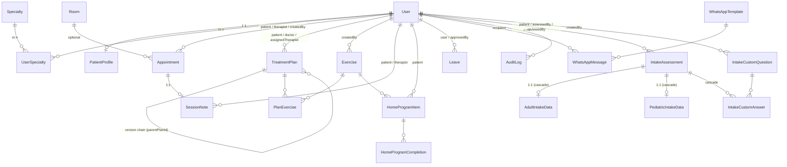

# Database schema

Owner: **Prompt 2**. The authoritative source is `prisma/schema.prisma`; this document
is a navigable summary plus the design decisions that are not visible in the schema.

## Entity-relationship diagram

## Model index

| #   | Model                   | Owning prompt(s)                                 | Purpose                                                          | Key constraints                                                         |
| --- | ----------------------- | ------------------------------------------------ | ---------------------------------------------------------------- | ----------------------------------------------------------------------- |
| 1   | `User`                  | Prompt 2 (creates), Prompt 4 (auth fields)       | Every actor — patients, secretaries, doctors, therapists, admins | Partial unique on `(phone)` and `(email)` scoped to `deletedAt IS NULL` |
| 2   | `PatientProfile`        | Prompt 2                                         | 1:1 demographic + clinical-context fields for patient users      | `assignedTherapistId` and `responsibleDoctorId` are nullable            |
| 3   | `Specialty`             | Prompt 2                                         | Clinical specialty taxonomy                                      | Unique `nameEn`, unique `nameAr`                                        |
| 4   | `UserSpecialty`         | Prompt 2                                         | M:N join between staff and specialties                           | Composite PK `(userId, specialtyId)`                                    |
| 5   | `Room`                  | Prompt 2                                         | Treatment rooms available for booking                            | —                                                                       |
| 6   | `Appointment`           | Prompt 2 (schema), Prompt 7 (workflow)           | Single scheduled visit between patient and therapist             | Index on `(therapistId, startsAt)` for conflict detection               |
| 7   | `TreatmentPlan`         | Prompt 2 (schema), Prompt 9 (workflow)           | Doctor-authored prescription, versioned via `parentPlanId`       | Partial unique `(patientId) WHERE status='ACTIVE'`                      |
| 8   | `PlanExercise`          | Prompt 2                                         | Exercises prescribed within a treatment plan                     | Cascade-deleted with its plan                                           |
| 9   | `Exercise`              | Prompt 2 (schema), Prompt 10 (library UI)        | Clinic-wide exercise library entry                               | Indexed by `category` and `anatomicalRegion`                            |
| 10  | `SessionNote`           | Prompt 2 (schema), Prompt 9 (workflow)           | SOAP note bound to a completed appointment                       | Unique `appointmentId` (one note per appointment)                       |
| 11  | `HomeProgramItem`       | Prompt 2 (schema), Prompt 10 (workflow)          | A single home exercise assignment for a patient                  | `scheduledTime` stored as `"HH:MM"` string — recurring local time       |
| 12  | `HomeProgramCompletion` | Prompt 2                                         | Patient's daily compliance signal                                | Unique `(itemId, scheduledDate)`                                        |
| 13  | `Leave`                 | Prompt 2 (schema), Prompt 11 (workflow)          | Staff leave request and approval                                 | —                                                                       |
| 14  | `WhatsAppTemplate`      | Prompt 2 (schema), Prompt 8 (workflow)           | Meta-approved template registry                                  | Unique `metaTemplateName`                                               |
| 15  | `WhatsAppMessage`       | Prompt 2 (schema), Prompt 8 (workflow)           | Every inbound and outbound WA message                            | Indexed by `(recipientPhone, sentAt DESC)` for inbound matching         |
| 16  | `AuditLog`              | Prompt 2 (table), Prompt 4 (`withAudit` wrapper) | Append-only log of every state-changing action                   | Indexed by `(entityType, entityId, createdAt DESC)`                     |
| 17  | `IntakeAssessment`      | Prompt 2                                         | Parent record for a patient intake event (adult OR pediatric)    | No unique on `patientId` — patients may be reassessed                   |
| 18  | `AdultIntakeData`       | Prompt 2                                         | Structured adult intake fields (1:1 cascade)                     | PK = `intakeId`                                                         |
| 19  | `PediatricIntakeData`   | Prompt 2                                         | Structured pediatric intake fields (1:1 cascade)                 | PK = `intakeId`                                                         |
| 20  | `IntakeCustomQuestion`  | Prompt 2 (schema), Prompt 5 (builder UI)         | Admin-defined extension questions for either intake type         | Options stored as JSON for SINGLE/MULTI select                          |
| 21  | `IntakeCustomAnswer`    | Prompt 2 (schema), Prompt 5 (intake UI)          | Patient answer to a custom question                              | Unique `(intakeId, questionId)`; cascade with intake                    |

## Decisions log

### 1. Why split intake into parent + adult / pediatric detail tables, not one JSONB blob

A blob would lose every aggregation. Pain-severity distributions, referral-source
breakdowns, comorbidity prevalence, and symptom-duration cohorts are all routine
analytics the clinic will want once data accumulates. With typed columns those queries
are plain `GROUP BY` over an enum. With JSONB they are fragile path queries that change
shape whenever the form changes.

The trade-off is a slightly more verbose schema (three tables instead of one). Worth it.

### 2. Why partial unique indexes live in raw SQL, not the schema

Prisma's schema language cannot express `WHERE` on a unique index. Three invariants
need it:

- One **ACTIVE** treatment plan per patient — completed / paused / discontinued plans
  must coexist freely.
- `phone` uniqueness scoped to `deletedAt IS NULL` — when a patient leaves the clinic
  and is soft-deleted, the next person who acquires their old phone number can register.
- `email` uniqueness scoped to non-deleted **and** non-null — patients on OTP-only login
  have NULL emails and there are many of them.

The init migration's SQL extension creates these indexes. `prisma migrate reset`
re-runs the whole migration in order, so the partial indexes always land.

### 3. Why patient profile fields are not duplicated in adult / pediatric intake data

Name, age, gender, address, occupation, and contact info live on `User` and
`PatientProfile`. The intake UI reads and updates those fields directly. Duplicating
them into `AdultIntakeData` would mean every demographic edit has to either propagate
into a stale intake snapshot or accept that historical intakes are wrong. Single source
of truth wins.

If the clinic later wants frozen demographic snapshots at the time of assessment
(say, for medico-legal reasons), add a snapshot field to `IntakeAssessment` instead
of relying on the detail tables.

### 4. Why every clinical FK defaults to `onDelete: Restrict`

Cascade deletes are how patient history disappears overnight. Restrict makes deletes
explicit: a user trying to remove a patient with appointments hits a clean
`P2003 FOREIGN_KEY_VIOLATION` and has to either archive the patient (soft delete on
`User`) or manually clean up the dependent records.

Cascade is reserved for three places where a child has zero meaning without its
parent: `AdultIntakeData → IntakeAssessment`, `PediatricIntakeData → IntakeAssessment`,
and `IntakeCustomAnswer → IntakeAssessment`. (Plus `PlanExercise → TreatmentPlan` —
exercises detached from a plan would be orphan rows.)

### 5. Why `scheduledTime` on `HomeProgramItem` is a `"HH:MM"` string, not a timestamp

A home exercise scheduled for 7 PM is a recurring local-time concept, not a single
moment. Storing it as a timestamp would either anchor it to a specific date (wrong) or
require us to invent a sentinel date (worse). The string is small, comparable, and
unambiguous; renderers convert with the active locale's `Intl.DateTimeFormat`.

### 6. Why `nationalId` is plaintext today with a TODO for `pgcrypto`

Adding column-level encryption in Phase 0 would couple the schema to a key-management
story we have not built yet. The field is marked as encryption-target in the schema
comment; Prompt 11 (hardening) introduces the `pgcrypto` migration plus the
KMS-backed key rotation flow.

### 7. Why `responsibleDoctorId` and `assignedTherapistId` on `PatientProfile` are nullable

A newly registered patient has neither. The secretary assigns a primary therapist as
part of intake; the doctor becomes "responsible" only when they author the first
treatment plan. Forcing the FKs at creation time would force placeholder assignments
that the secretary then has to remember to update — easier to just allow null and
require it at the point each role is actually committed.
